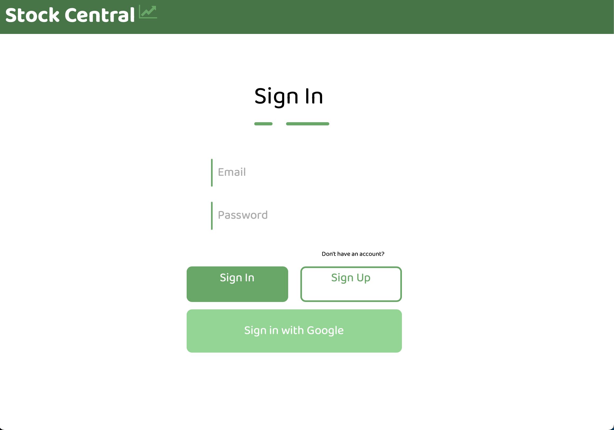

# Stock-Central

Stock Central is a large, full scale social media app for investors. Day traders, institutional investors, and hobbiest alike can come together and share their latest trades, trending companies, and breaking financial news.

NOTE: Trying to view this website locally will result in an error. The website depends on several APIs, including IEX, AlpacaAI, and Firebase. The private keys for those services have been ommited from this repo for security and privacy reasons. Additionally, I allowed the subscriptions for many of these services to lapse, since they were starting to add up. However, there are demo images includes, and the source code is available to the public.
Another Note: This project was a group effort. While I did a fair amount of the prorgamming, I feel a need to acknowledge that I recieved some help from other group members.
